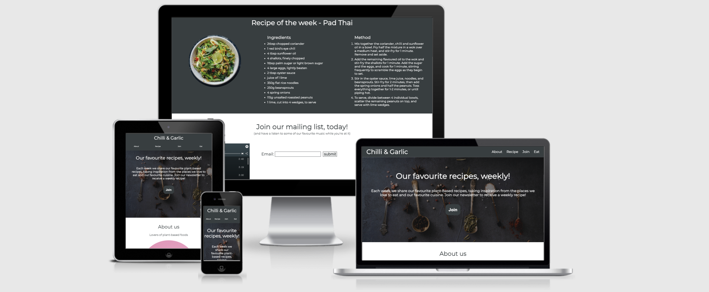
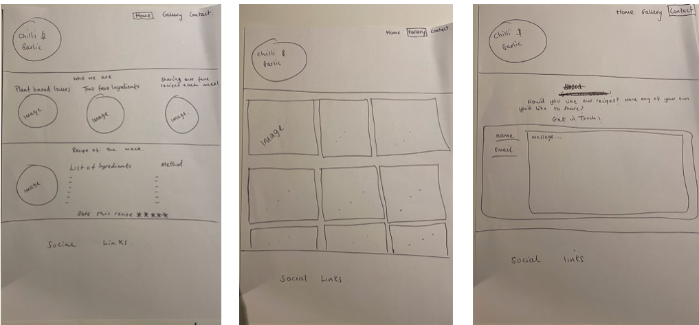
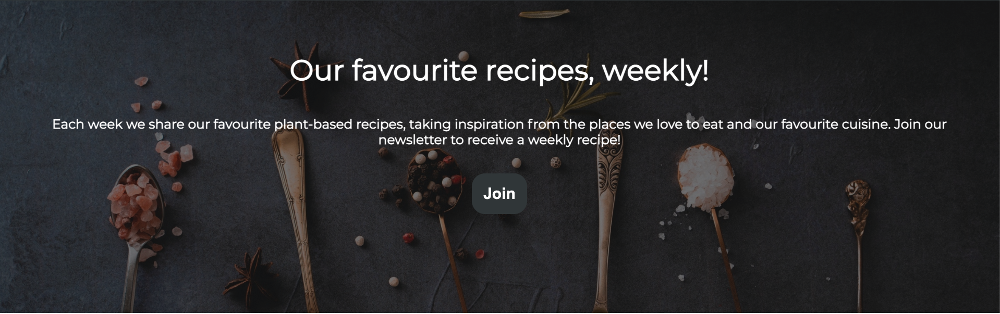

# 
<b>Chilli & Garlic</b>

# <b>Introduction</b>

Chilli & Garlic was created with the aim to inspire plant-based food lovers with new and exciting recipes that are posted to the site every week. The site features a recipe of the week, mailing list, spotity playlist and a list of the couples favourite restaurants.

The live site can be accessed [here](https://digitilley.github.io/chilli-and-garlic/)

# <b>Design</b>
- Color Pallete
    - The two main colours used are Onyx and White.
    - I had originally wanted to use Light Coral and White but due a poor 
    accessibility score on Google Lighthouse, I had to change it.
- Typography
    - The Montserrat font is used throughout with Sans-Serif as the backup font.

- Initial Concept
    - The initial concept was designed first to structure the layout of the content and media that was envisaged. 
    - I had originally wanted to create the site with 3 separate pages but unfortunately had to settle on 4 sections due to time constraints.

# <b>Features</b>

This sect#on covers the features used for the website to function seamlesslesly, ensuring accessibility requirements are achieved at the same time.

### <b>Existing Features</b>
-   <b>Navigation Bar</b>
    - The navigation bar includes an About, Recipe of the Week, Join our mailing list and a Favourite Restaurant section

- <b>The Hero Image</b>
    -   The hero image was selected to break up the blank space and offer something more visual to the user. I added a level of transparancy to ensure the text was fully visible to ensure accessibility for all users was optimised.

- About Section
    - 

