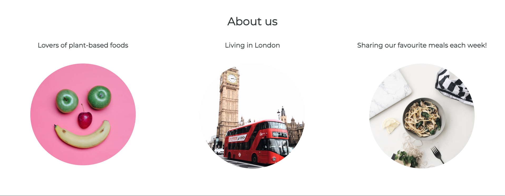
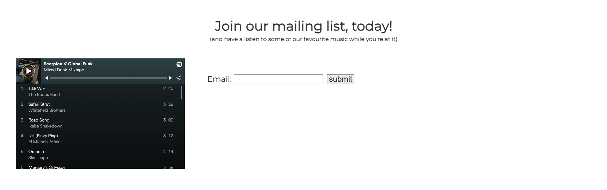
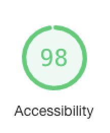

# 
<b>Chilli & Garlic</b>

# <b>Introduction</b>

Chilli & Garlic was created with the aim to inspire plant-based food lovers with new and exciting recipes that are posted to the site every week. The site features a recipe of the week, mailing list, spotity playlist and a list of the couples favourite restaurants.

The live site can be accessed [here](https://digitilley.github.io/chilli-and-garlic/)

# <b>Design</b>
- Color Pallete
    - The two main colours used are Onyx and White.
    - I had originally wanted to use Light Coral and White but due a poor 
    accessibility score on Google Lighthouse, I had to change it.
- Typography
    - The Montserrat font is used throughout with Sans-Serif as the backup font.

- Initial Concept
    - The initial concept was designed first to structure the layout of the content and media that was envisaged. 
    - I had originally wanted to create the site with 3 separate pages but unfortunately had to settle on 4 sections due to time constraints.

# <b>Features</b>

This sect#on covers the features used for the website to function seamlesslesly, ensuring accessibility requirements are achieved at the same time.

### <b>Existing Features</b>
-   <b>Navigation Bar</b>
    - The navigation bar includes an About, Recipe of the Week, Join our mailing list and a Favourite Restaurant section

- <b>The Hero Image</b>
    -   The hero image was selected to break up the blank space and offer something more visual to the user. I added a level of transparancy to ensure the text was fully visible to ensure accessibility for all users was optimised.

- <b>About Section</b>
    - The About Us section of the website provides a brief insight to who the site owners are and why they've created the website.
    - The images used were intended to be playful and stylish. 

- <b>Recipe Of The Week Section</b>
    - The Recipe of the Week section of the website shares a weekly plant-based recipe for the user to try out, it showcases an image of the meal and provides a detailed ingredients list, and cooking method.
    - The image styling was kept consistent with the About Us section for a consistent UX

- <b>Join Our Mailing List</b>
    - The Join Our Mailing List section of the website was added to give users the ability to opt in for weekly emails of new and exciting plant-based recipes. 
    - An embeded Spotify playlist was also added to give users the ability to listen to the site owners favourite songs while trying out the suggested recipe.

- <b>Our Favourite Restaurants</b>
    - The Our Favourite Restaurants section was added to share with users where the site owners draw inspiration from for their suggested meals. 
    - An embeded Google Maps list of locations was used to provide an interactive and resourceful source of restaurants in London. 

- <b>Footer</b>
    - The Footer includes social media links to the site owners social media accounts, ensuring users can easily find and follow them.

- ### Validator Testing
    - HTML
        - No errors were returned when passing through the official [W3C Validator](https://validator.w3.org/nu/#textarea)
    - CSS
        - No errors were found when passing through the official [Jigsaw Validator] (https://jigsaw.w3.org/css-validator/validator)
    - Accessibility
        - Scored the minimum 98% throughout the whole site.
    
    

